是否厌倦了哪吒V1繁琐的配置、一层包一层的配置选项……~~（没有拉踩的意思，大家一起进步）~~

本文教你如何快速搭建一个全新的小鸡监控探针平台。

~~我看L站没有介绍，对其一下信息差，让佬们都能用上这个探针～~~

## 原文介绍

Komari 是由[Doornail](https://www.nodeseek.com/space/16791)开发的一款轻量级的自托管服务器监控工具，旨在提供简单、高效的服务器性能监控解决方案。它支持通过 Web 界面查看服务器状态，并通过轻量级 Agent 收集数据。Komari完全开源，包括前端网页。[komari-monitor/komari](https://github.com/komari-monitor/komari)

Komari使用Websocket通信，**只要你的CDN支持、就可以通过CDN与Agent建立连接**，无需准备多个域名。

>Demo站点: [https://komari.akz.moe](https://www.nodeseek.com/jump?to=https%3A%2F%2Fkomari.akz.moe) , 账号 `admin` 密码 `azVlSV80dhM6`
> (Demo站点将只开放一段时间，**请不要**将允许远程控制的Agent安装到Demo站点)
> (另：Demo站点用的白嫖的AWS EC2，随时停机)

## 快速开始

### 需要的材料

1.一台24小时在线的主机端，运行任意发行版系统。

### 1. 使用一键安装脚本

适用于使用了 systemd 的发行版（Ubuntu、Debian...）。

```
curl -fsSL https://raw.githubusercontent.com/komari-monitor/komari/main/install-komari.sh -o install-komari.sh
chmod +x install-komari.sh
sudo ./install-komari.sh
```

### 2. Docker 部署 **「推荐」**

创建数据目录：

```
mkdir -p ./data
```

运行 Docker 容器：

```
docker run -d \
  -p 25774:25774 \
  -v $(pwd)/data:/app/data \
  --name komari \
  ghcr.io/komari-monitor/komari:latest
```

> 国内服务器部署可以使用 `ghcr.nju.edu.cn` 加速拉取

查看默认账号和密码：

```
docker logs komari    
```

> 你也可以通过环境变量 `ADMIN_USERNAME` 和 `ADMIN_PASSWORD` 自定义初始用户名和密码。

### 3. 二进制文件部署

访问 Komari 的 [GitHub Release 页面](https://github.com/komari-monitor/komari/releases) 下载适用于你操作系统的最新二进制文件。

运行 Komari：

```
./komari server -l 0.0.0.0:25774
```

1. 在浏览器中访问 `http://<your_server_ip>:25774`，默认监听 `25774` 端口。

2. 默认账号和密码可在启动日志中查看，或通过环境变量 `ADMIN_USERNAME` 和 `ADMIN_PASSWORD` 设置。

>   确保二进制文件具有可执行权限（`chmod +x komari`）。数据将保存在运行目录下的 `data` 文件夹中。

## 配置反向代理

此处使用 1Panel V2 + OpenResty 进行反向代理，宝塔面板操作同理。V1 V2操作无差别

> 如果你使用Cloudflare创建的证书请直接导入1Panel面板。不过此处**并不建议使用CF证书避免泄露源站**。

### 1.创建证书

在 1Panel中的**网站**选项卡中选择**证书**

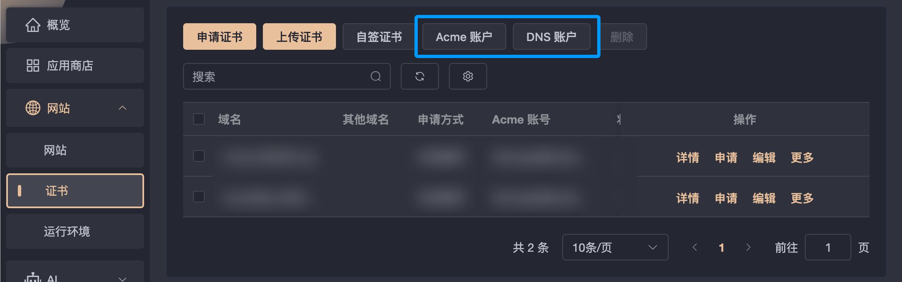

配置好**Acme账户**和**DNS账户**，此处ACME账户更推荐创建ZeroSSL，原因见:[为什么选择ZeroSSL](https://ffis.me/archives/2110.html)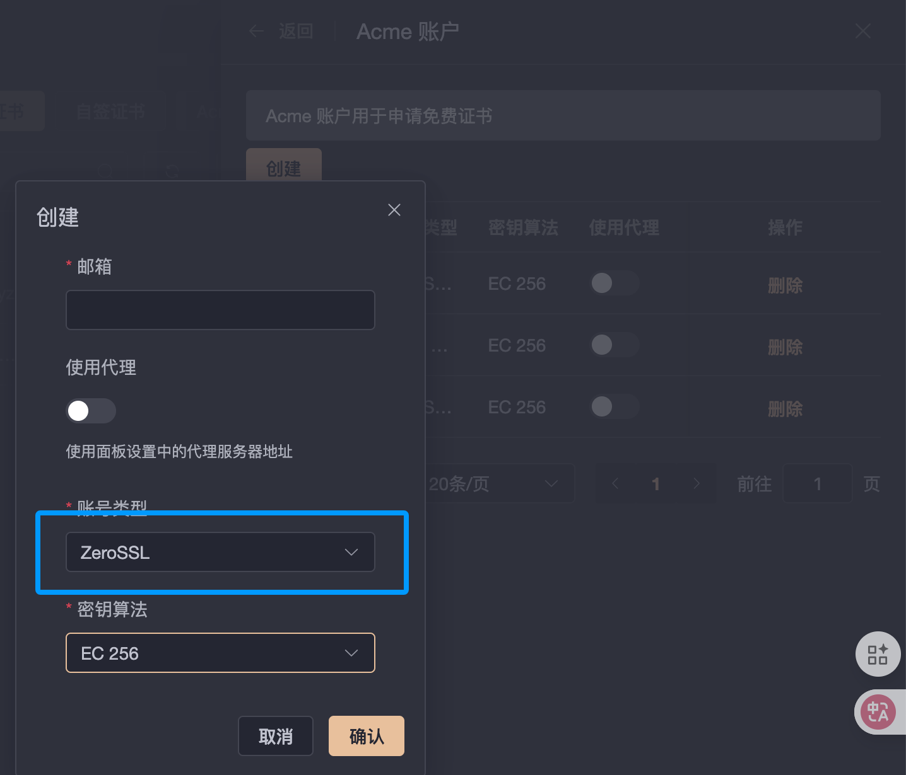

### 2. 创建反向代理

前往**网站**选项卡，点击创建网站，在弹出界面的上部选择反向代理，并填写好需要监听的域名

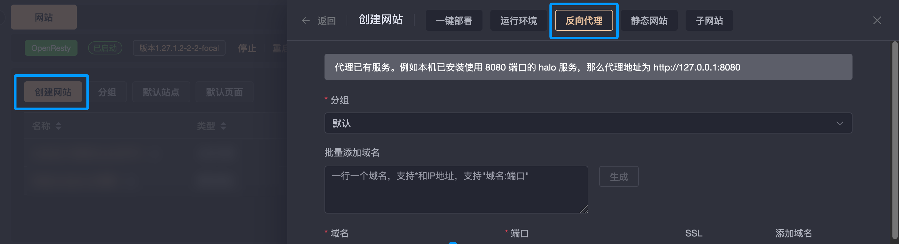

此处选择**启用HTTPS**，并且勾选我们已经创建好的证书。

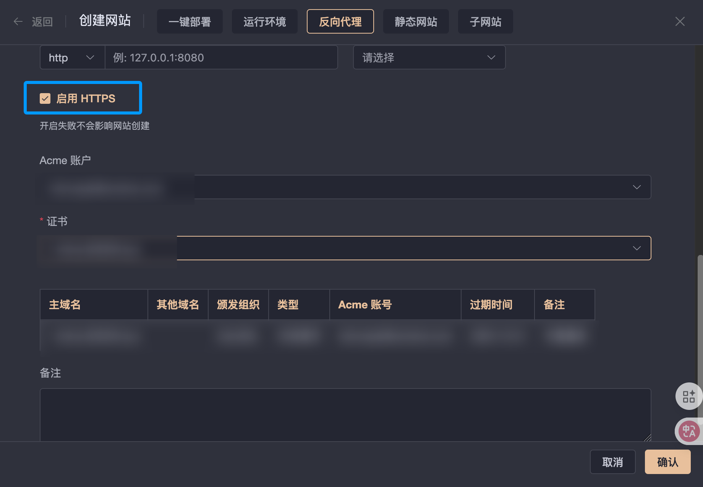

确认无误，保存继续。

## CDN配置

### 1. 域名解析配置

此处使用Cloudflare托管域名，开启小黄云隐藏源站，方便可控。

**请先添加好解析，并且勾选小黄云。**

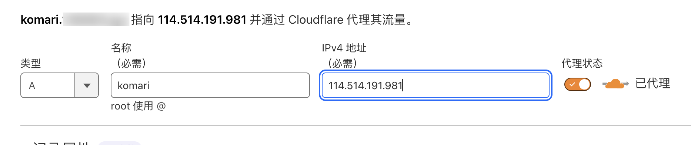

### 2. SSL/TLS配置

> SSL/TLS >> 概述

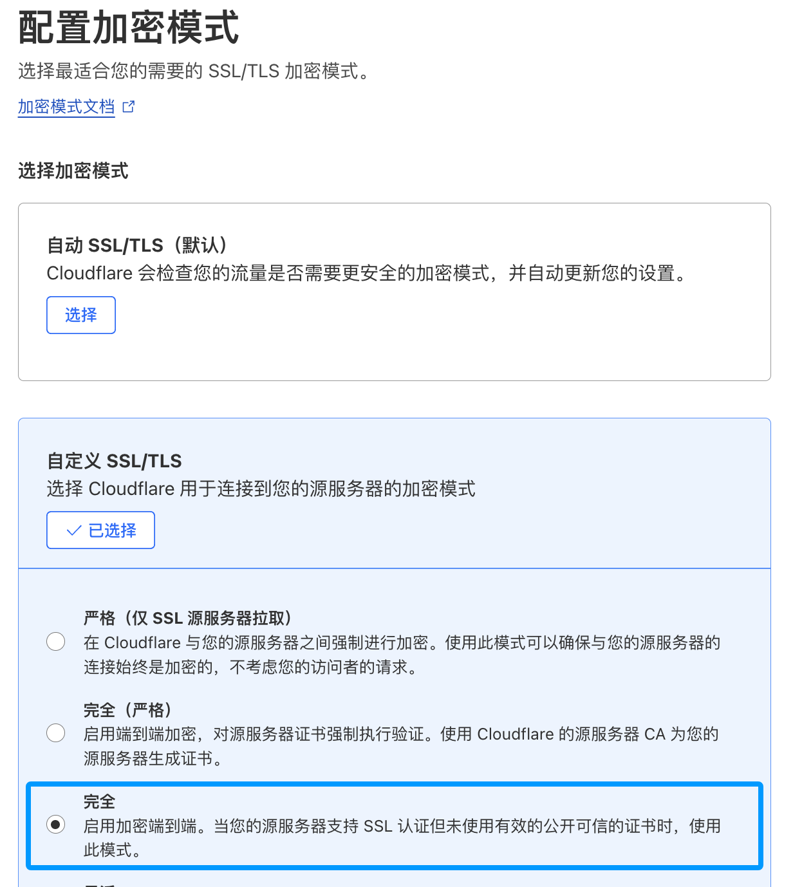

如果你使用的是上文自建证书，请确保此处的加密模式使用的是**完全 / FULL**

如果你是用的是Cloudflare的自签证书，请选择**完全(严格)**

### 3. 启用gRPC和HTTP/3

此处非必须，如需要部署哪吒面板必须得选项，如果想回哪吒记得开起来

> 网络 >> gRPC

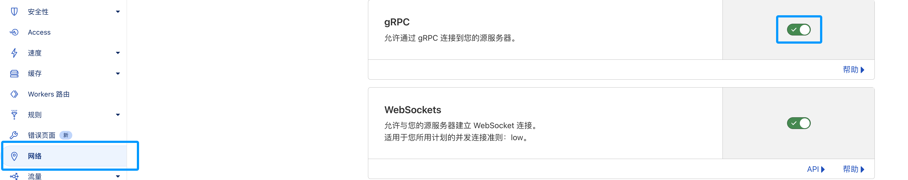

> 速度 >> 优化 >> 协议优化

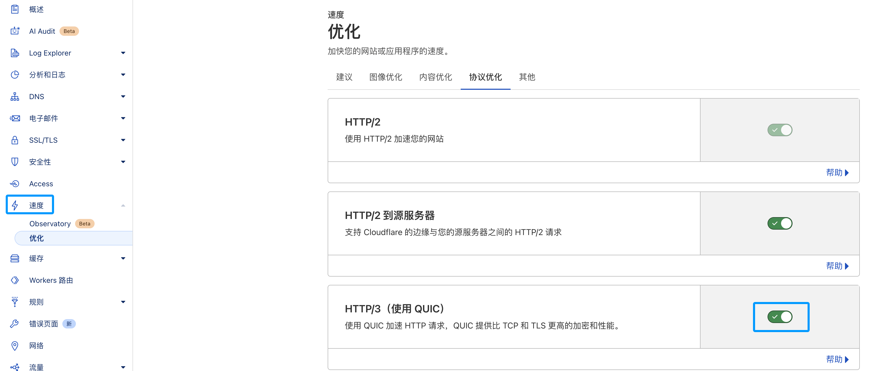

## 访问管理面板

输入你的设置好反向代理的域名，如果上述配置均无问题，你可以正常进入管理面板无警告提示。

### 登录

点击右上角的登录按钮，默认用户名为admin，默认密码请前往日志中查找。

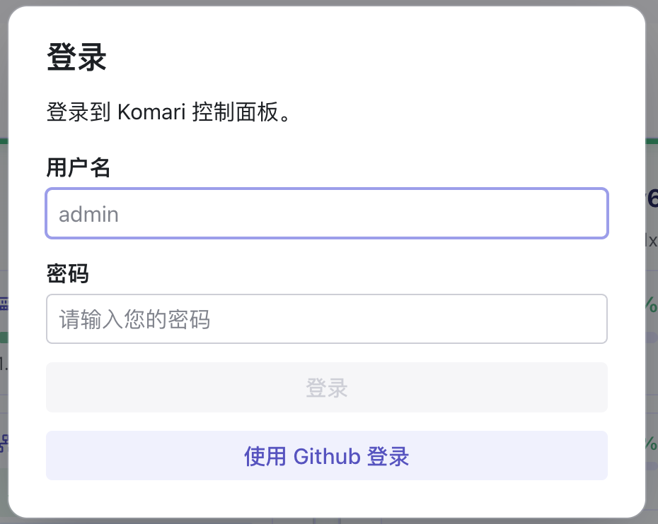

### 修改密码 

> 前往 **账户**选择卡，在界面上根据提示修改默认管理员用户名和密码

## 添加被控端

### 1. 编辑被控信息

选择**服务器**选项卡，点击右上角的添加节点，顾名思义，先填写这个节点的名称

> 可以是 `服务商+国家+记忆点` 的命名方式，规范化命名。
>
> 例如 : 搬瓦工 美西 DC1

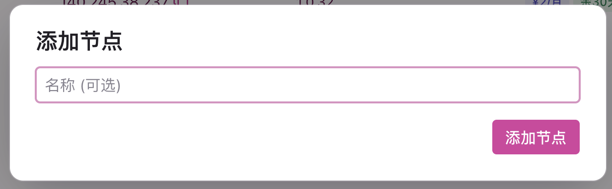

添加节点之后在你的节点列表中出现了一个刚才创建的节点。

点击铅笔图标进入编辑，你可以在此处修改详细的信息

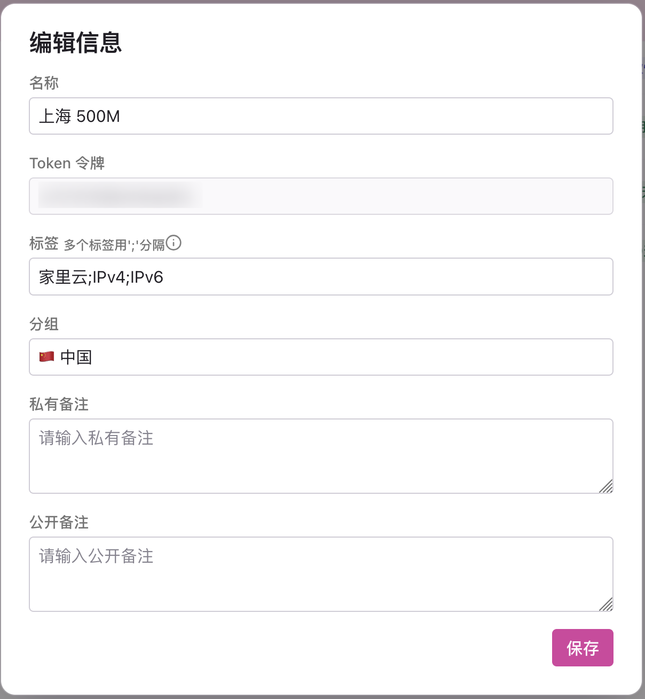

随后点击钱币图标进入费用编辑，顾名思义，填写小鸡的价格、续费信息等

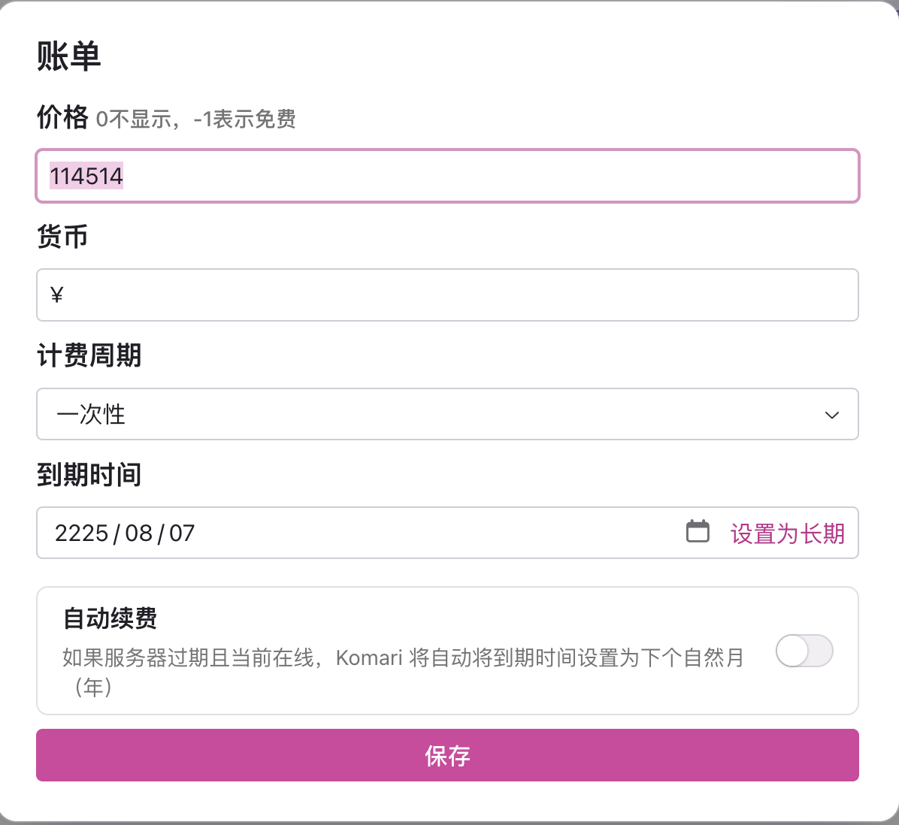

一切信息添加妥当后，进入部署环节。

### 2. 部署到节点

点击创建好的节点操作按钮中的下载图标，进入安装脚本的配置环节。

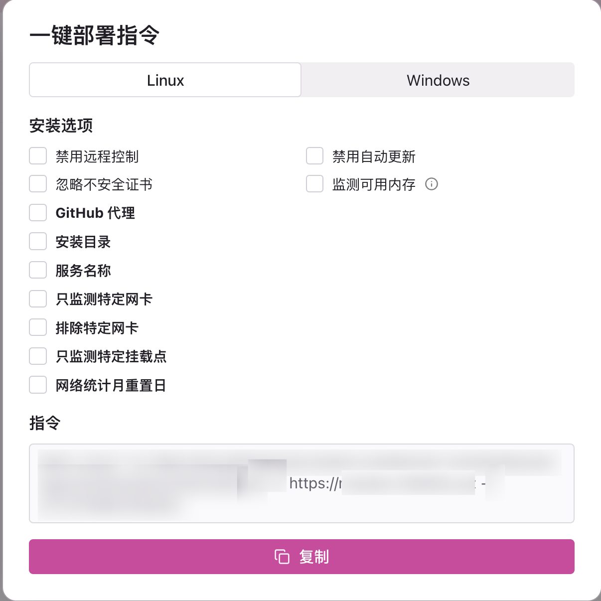

此处如果没有特殊需求，直接点击复制。

> 如果服务器在国内遇到Github拉取困难，请选择`Github代理`，并且填写一个代理地址，这个地址会增加到`raw.githubusercontent.com`前，加速下载被控程序

其他配置需求已经很浅显易懂了，根据自己的需求配置即可。

接下来把命令直接粘贴到你的服务器SSH中，当出现下面的结果时，部署成功。

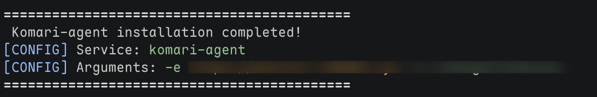

此时回到你的面板端，刷新一下即可在你的节点列表中找到你的服务器。


你可以回到展示主页，查看一下读取的信息是否正确。

## End

到此处，你的基本配置已经完成，如果没有出错，你已经获得了一个Komari探针。恭喜你！

## 故障排查

### 1. 被控端迟迟不上线

等待5~10分钟后被控端还是无上线迹象，请在被控端输入

```shell
journalctl -u komari-agent -f
```

查看日志信息寻找原因。如果遇到自己无法解决的问题请向原作者提出Issue或者在TG群内获得帮助。

### 2. [komari探针有时丢包率整齐划一奇高怎么回事](https://www.nodeseek.com/post-416326-1)

作者反馈是一个已知问题，等待更新

### ……未完

